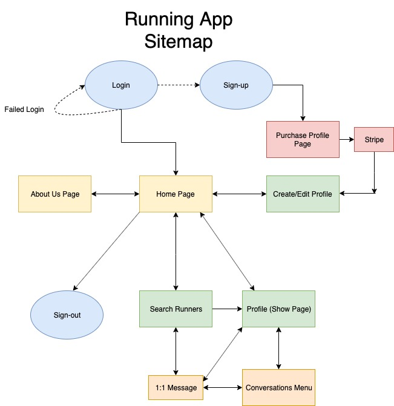
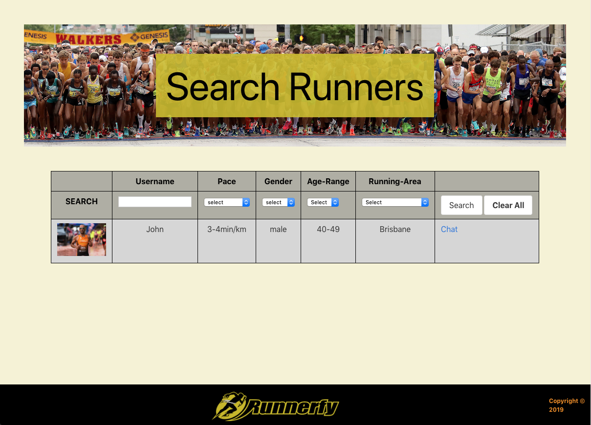
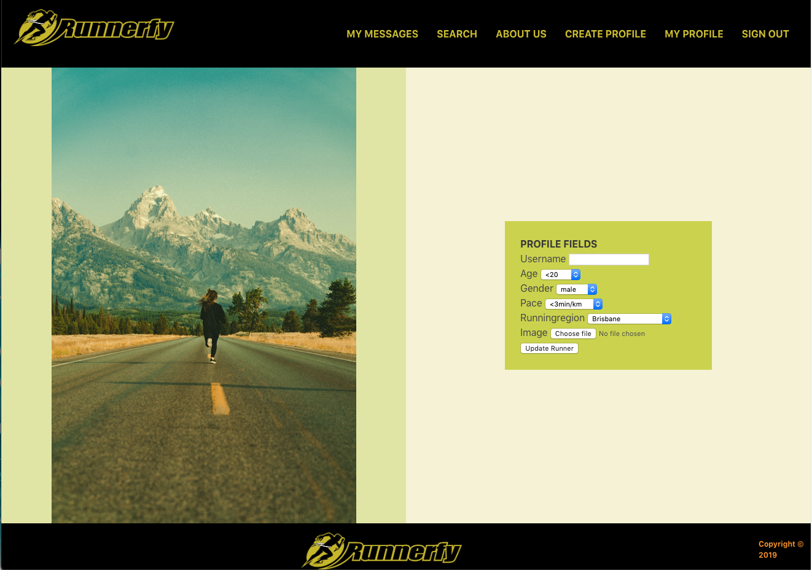
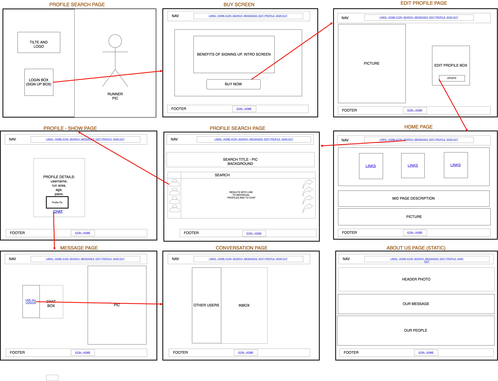
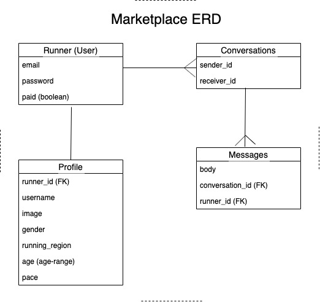
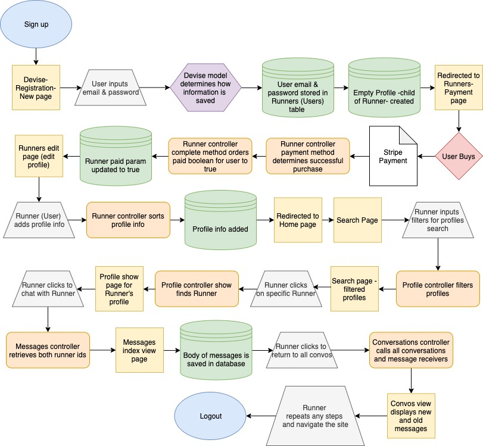

# Two-sided Marketplace Running App

## The market this app addresses

The market opportunity for this application is that there are plenty of fitness and running applications out there and there are plenty of social media platforms, but there are none that combine both to promote runners meeting who share similar preferences and running skill sets. 

## Why is it a problem that needs solving?

The problem needs to be solved because, from my experience and the experience many runners I have spoken with, it is difficult for runners to find others who are at their runner level to train with. When two running partners are not on a similar level, one of the two will be running at a slower pace or a shorter distance than they are capabale of. Finding running partners who share a similar fitness level and running preferences is key to growth in the sport. 

## Links
    
- Deployed site (via Heroku): https://nameless-plains-85241.herokuapp.com/

- Github repo: https://github.com/DanielLMA/MarketplaceRailsApp

## Description:

### Purpose:

The purpose of Runnerfy is to help runners find running partners based on their specified needs. It is not hard to find others who do run, but to match one's skill level and preferances (e.g. preferred running pace, location, distance, time of day, frequency) is a difficult task. Just as in any other sport, one's best means of improving skill level is to train with others at a similar level. 

### Functionality / features:

Users will 

### Sitemap:

### Screenshots:

#### Login page

#### Search page

#### Edit Profile page

### Target audience:

My target audience will be runners in the Brisbane, QLD area. The site will not be restricted to any type of runner. All skill levels are welcome. After an initial test period in the Brisbane area, expansion to other markets will be considered. 

### Tech-stack:

- HTML
- Sass / CSS
- Bulma
- JavaScript
- Ruby on Rails
- PostgreSQL
- Heroku

## User stories 

https://trello.com/b/Oj37iks3/marketplace-project

## Wireframes

#### Desktop 

## ERD

# high-level components (abstractions) in your app

## Third-party Services 

Heroku: Container-based cloud Platform as a Service used to deploy, manage, and scale this application. 
Stripe: APIs used integrate payment processing into the application for subscription fee/creation of profile. 
Cloudinary: Used for storage of uploaded images to a user's profile. 
Github:  An open-source version control system used for tracking and making changes to the application. 

##  Models' relationships (active record associations) with each other

The Runner model is the first model that is created when a user clicks "Sign-up" on the site login. A Runner is associated with the attributes delegated to a Devise user. From the Runner creation, the profile is directly created with a <code>has_one</code> relationship to the Runner (User). The profile attributes are nested within the Runner model and there is a <code>before_create</code> the creates the associated Profile model. The Profile validates the uniqueness of the <code>:runner_id</code> as a Runner has only one unique Profile. A Runner is then directed to populating their Profile, which has a <code>belongs_to</code> association with the Runner. They can attach an image with a <code>has_one_attached</code> association. The Runner model also has an association with the Conversations model. A Runner "has_many" conversations, the Conversation model <code>belongs_to</code> the Runner, this being to both the receiver and the sender within a conversation. The uniqueness of this is defined in the model where the uniqueness of the sender is validated via the <code>:sender_id</code>, which is scoped to the <code>:receiver_id</code> within the Conversation model, Conversation <code>has_many</code> messages; Messages <code>belongs_to</code> Conversation and <code>belongs_to</code> a specific Runner. 

## Database relations to be implemented in your application

Relations exist between the models created for this application. The Runner (User) has one Profile, that as a child, has a foreign-key associating it with its parent: Runner. This profile is what is filtered and searched by other Runners. It contains the displaying information while the Runner information is used for the login and authentication process. The Runner is authenticated through devise. A Runner has a Conversation model and these conversations have messages that have foreign keys which connect the message with a runner_id and a conversation_id. The Runner model also has an association with the Conversations model. A Runner "has_many" conversations, the Conversation model <code>belongs_to</code> the Runner, this being to both the receiver and the sender within a conversation. Messages <code>belongs_to</code> Conversation and <code>belongs_to</code> a specific Runner. 

## Database schema design

## Describe the way tasks are allocated and tracked in your project

Tasks are allocated and tracked within the project soley through Trello. As this project is a one-man team, there is no external delegating or project allocation. On the Trello board, there are different levels of task progress: Do, Doing, Test, Done. Tasks are handled based on dependency and what needs to be done first (e.g. styling of the site can't be done before all functions are set). Progress is also tracked on a personal journal of goals and completions of tasks each day. 

#### Journal Entry

