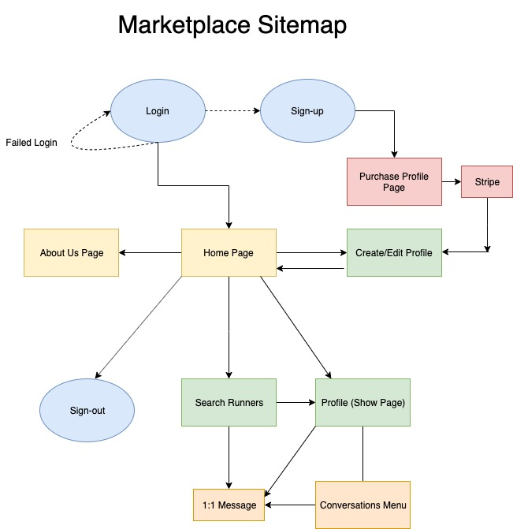

# README

R7	Identification of the problem you are trying to solve by building this particular marketplace app.

    The problem that needs solving is that there are plenty of fitness and running applications out there and there are plenty of social media platforms, but there are none that combine both to promote runners meeting who share similar preferences and running skill sets. 

    

R8	Why is it a problem that needs solving?

    The problem needs to be solved because, from my experience and the experience many runners I have spoken with, it is difficult for runners to find others who are at their runner level to train with. When two running partners are not on a similar level, one of the two will be running at a slower pace or a shorter distance than they are capabale of. Finding running partners who share a similar fitness level and running preferences is key to growth in the sport. 

R9	A link (URL) to your deployed app (i.e. website)
    URLXXXXXXXXXXXXXXXXXXX

R10	A link to your GitHub repository (repo).

XXXXXXXXXXXX

R11	Description of your marketplace app (website), including:
- Purpose

    The purpose of Runnerfy is to help runners find running partners based on their specified needs. It is not hard to find others who do run, but to match one's skill level and preferances (e.g. preferred running pace, location, distance, time of day, frequency) is a difficult task. Just as in any other sport, one's best means of improving skill level is to train with others at a similar level. 

- Functionality / features

    Users will 

- Sitemap

    

- Screenshots

- Target audience

    My target audience will be runners in the Brisbane, QLD area. The site will not be restricted to any type of runner. All skill levels are welcome. After an initial test period in the Brisbane area, expansion to other markets will be considered. 

- Tech stack (e.g. html, css, deployment platform, etc)

    Front end: html, CSS (scss), bulma (??)
    Back end: ruby on rails 

#User stories 

#Wireframes for your app

#ERD

      

R15	Explain the different high-level components (abstractions) in your app

#Third-party Services 

    There are several third party services that are utilized in this application: 

        Heroku: Container-based cloud Platform as a Service used to deploy, manage, and scale this application. 
        Stripe: APIs used integrate payment processing into the application for subscription fee/creation of profile. 
        Cloudinary: Used for storage of uploaded images to a user's profile. 
        Github:  An open-source version control system used for tracking and making changes to the application. 
        

R17	Describe your projects models in terms of the relationships (active record associations) they have with each other

    The Runner model is the first model that is created when a user clicks "Sign-up" on the site login. From this, the profile is directly created with a "has_one" relationship to the Runner (User). A Runner is then directed to populating their Profile, which has a "belongs_to" association with the Runner. They can attach an image with a "has_one_attached" association. The Runner model also has an association with the Conversations model. A Runner "has_many" conversations, the Conversation model "belongs_to" the Runner. Within the Conversation model, Conversation "has_many" messages; Messages "belongs_to" Conversation and "belongs_to" a specific Runner. 

R18	Discuss the database relations to be implemented in your application

    Relations exist between the models created for this application. The Runner (User) has one Profile, that as a child, has a foreign-key associating it with its parent: Runner. This profile is what is filtered and searched by other Runners. It contains the displaying information while the Runner information is used for the login and authentication process. The Runner is authenticated through devise. A Runner has a Conversation model and these conversations have messages that have foreign keys which connect the message with a runner_id and a conversation_id. 

R19	Provide your database schema design

    (Please refer to the ERD above)

R20	Describe the way tasks are allocated and tracked in your project

Tasks are allocated and tracked within the project soley through Trello. As this project is a one-man team, there is no external delegating or project allocation. On the Trello board, there are different levels of task progress: Do, Doing, Test, Done. Tasks are handled based on dependency and what needs to be done first (e.g. styling of the site can't be done before all functions are set). Progress is also tracked on a personal journal of goals and completions of tasks each day. 

